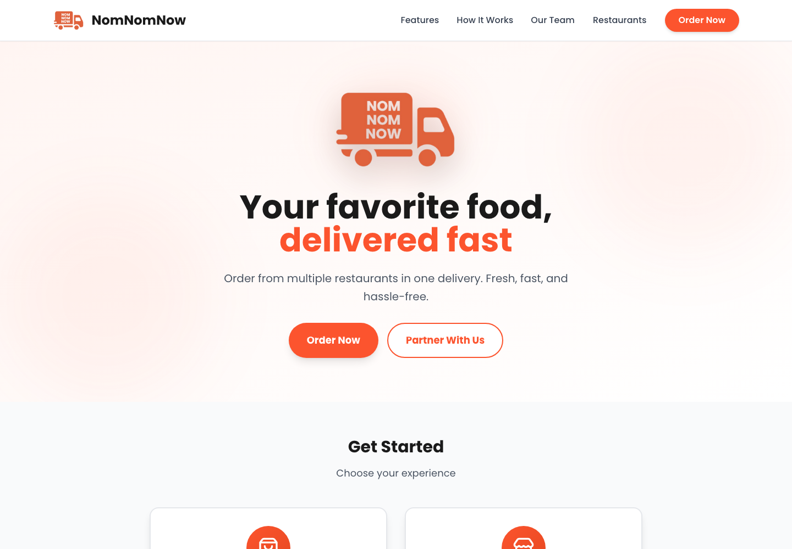
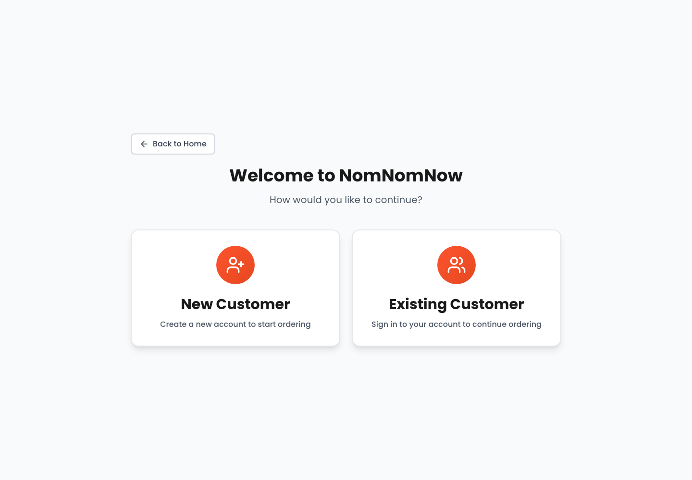

# NomNomNow

A food-ordering frontend that brings restaurant discovery, a multi-restaurant cart, and restaurant management into one interface.



**[Explore the frontend](https://kiril-p.github.io/Cloud-Computing-Final-Project/)**

A team project for Cloud Computing at IE University. This page showcases the React frontend: the customer journey, restaurant tools, and responsive interface.

## Explore the interface

| Customer experience | Restaurant experience |
| --- | --- |
| Choose or create a customer profile | Browse and search restaurants |
| Filter restaurants by delivery area and search | Create a restaurant profile |
| Browse menus and build a cart across restaurants | Edit restaurant details |
| Adjust quantities and review delivery estimates | Add, edit, and toggle menu-item availability |
| View profile details and order history | Manage the menu from one workspace |



The screenshots show the actual frontend. The hosted landing page and entry screens can be explored directly; restaurant data, profile creation, and order operations depend on the configured API. If it is unavailable, data-driven lists can be empty. The customer selector is a demo profile flow, not a secure sign-in system.

## Frontend structure

- **React 19 + TypeScript** for views, typed data, and cart state.
- **Tailwind CSS 3.4** for responsive layouts and styling.
- **Lucide React** for interface icons.
- **Vite** for development and production builds; **GitHub Pages** for the hosted frontend.

| Path | Responsibility |
| --- | --- |
| [`src/App.tsx`](src/App.tsx) | View transitions, selected profiles/restaurants, and cart state |
| [`src/components/CustomerView/`](src/components/CustomerView/) | Customer entry, discovery, menus, cart, and profile screens |
| [`src/components/RestaurantView/`](src/components/RestaurantView/) | Restaurant and menu management screens |
| [`src/utils/mockData.ts`](src/utils/mockData.ts) | API requests and localStorage-backed data access |
| [`src/types/`](src/types/) | Shared frontend data types |

## Run locally

From the repository root:

```sh
bun install
bun run dev
```

```sh
bun run build
bun run preview
```

The frontend uses the API addresses already configured in the source. Starting Vite does not start a backend or supply sample restaurant data. No API credentials are needed to view the landing screen.

## Team

| Contributor | Project milestone |
| --- | --- |
| Kiril Petrovski | Project bootstrap and setup |
| Nicolás Daniel Grass López de Silanes | Restaurant ecosystem and data |
| Rodrigo Blanco Maldonado | Frontend design and UI |
| Ali Ahmad Lutfi Samara | Azure Functions integration |
| Icíar Adeliño Ordax | Final polish and presentation |
| Christoph Rintz | Advanced features and enhancements |
